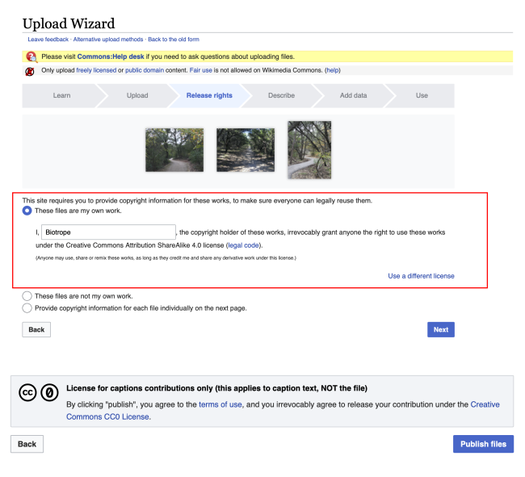
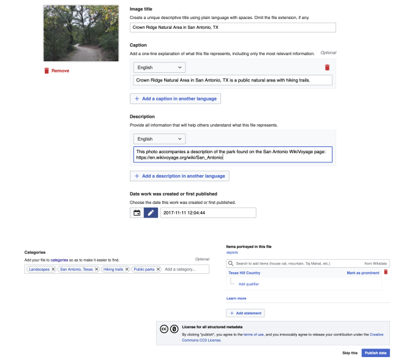
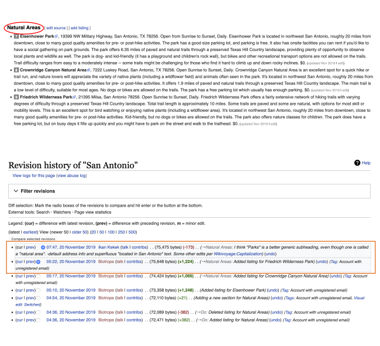

```{r setup, include=FALSE}
knitr::opts_chunk$set(echo = FALSE)
```

## Project Overview

**LibriVox**
  
  * Felt like a "closed" group
  * Lack of projects
  * Weird moral quandary


**WikiVoyage**
  
  * Easy to sign up
  * No need to seek permission to participate
  * More personal content for me


--- 

<div class="columns-2" align="left">
  
  
<div align="right">  
**Adding Content** 
  
  * Account Creation
  * Wikitext
  * Listing Template
</div></div>

--- 

<div class="columns-2" align="left">
  
  
<div align="right">  
**GeoMap** 
  
  * Lookup by address
  * Zoom in/out
  * Copy coordinates
</div></div>

--- 

<div class="columns-2" align="left">
  
  
<div align="right">  
**WikiMedia Commons** 
  
  * Upload
  * Creative Commons
  * Assign License
</div></div>

--- 

<div class="columns-2" align="left">
  
  
<div align="right">  
**Image Metadata** 
  
  * Descriptive
  * Structural
  * Administrative
</div></div>

--- 

<div class="columns-2" align="left">
  
  
<div align="right">  
**REVISIONS!** 
  
  * Made me feel weird
</div></div>