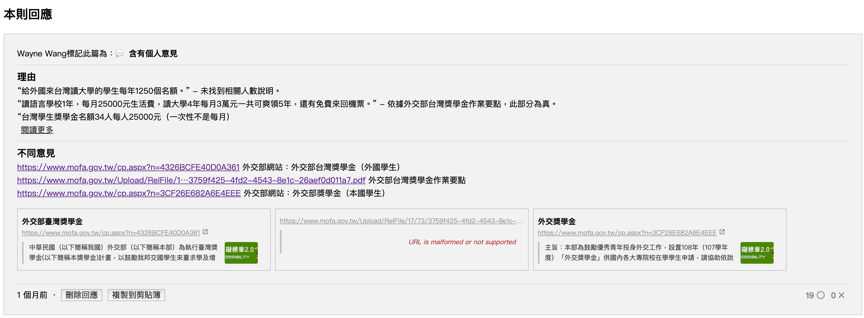
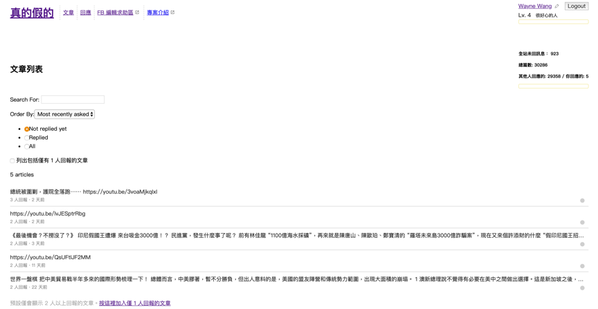

```{r setup, include=FALSE}
knitr::opts_chunk$set(echo = FALSE)
```

## The Cofacts project on G0V

**What is G0V**\
- The biggest open-source community in Taiwan\
- Advocating information transparency and civic hacking\
- Try to improve government operation with many different projects\

**The project Cofacts**\
- Help people fight against internet hoaxes\
- Create a chatbot in LINE, a popular communication app in Taiwan\
- Sent links of messages to the chatbot to find responses about the correctness of the message\


## How people work in Cofacts\
**There are three groups of contributors in Cofacts**\
1. **Engineer**: chatbot and database programming\
2. **Designer**: information architecture and interface design\
3. **Editor**: investigate and write response to potential hoax information reported by Cofacts users\

**Co-work in Cofacts**\
Cofacts has its own website, hack folder, and an editor platform.

Users report potential hoax information\
>> Receive information on editor platform\
>> Editors search for evidence for the information\
>> Editors write responses about information\
>> Users get the responses

## What I did in Cofacts
- Participate as an editor
- Respond to 4 messages reported by users
- Receive 19 ratings for one of the responses as helpful



## Did I meet my expectations?
- I expected to write more responses (more than 10)
- Feel the value of my works
- The information reported is unexpexted

