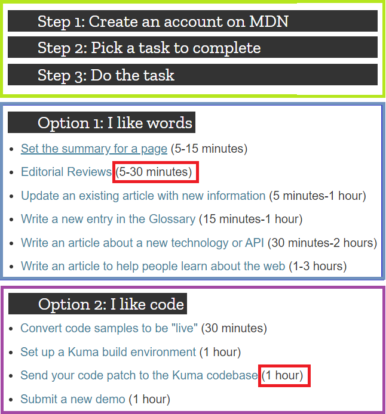

```{r setup, include=FALSE}
knitr::opts_chunk$set(echo = FALSE)
```

## Introduction

* The community supports the technologies surrounding web development such as:
    + HTML
    + CSS
    + JavaScript
    + Graphics
    + Gaming Technologies  
<br />  

* The site offers:
    + Tutorials
    + Reference Material
    + Developer Guides

## Contribution


  
</div>

## Peer Production Experience

- The MDN community was very welcoming
- It was easy to get started
- Could review past contributions
- Wiki page editing was very efficient/effective
<br />

- Content review process
- Easy to revert errors
- Was not exposed to any automated scanning tools
- Did not try technical contributions or evaluate technical contribution workflow

## Peer Production Reflection
- The MDN Peer Production community is very effective and efficent with participant to contributor conversion
- More bazaar than cathedral
- It was very easy and seamless to get started
- Tapped into the intrinsic motivation of a contributor
- Could be a Community of Practice or a Community of Interest
- Did not reengage with contributors, provide monthly contribution summaries, incentivize renewed participation
    - Did not tap into extrinsic motivation triggers well

## Conclusion
- I enjoyed the process of becoming a part of the MDN community
- Their site tools and governance model allowed a quick transition from a participant to a contributor
- I felt I had the tools, support, and framework to succeed with the project
- They could benefit from tapping into extrinsic motivation a bit more
- The MDN project is well setup for robust peer production contributions into the future
<br />
