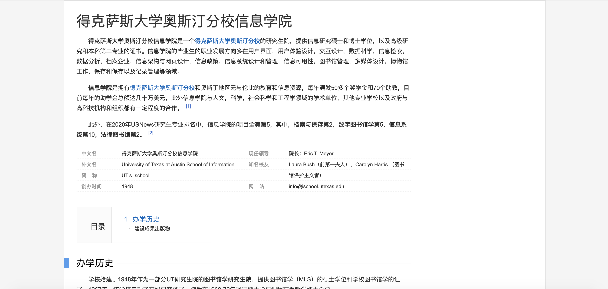
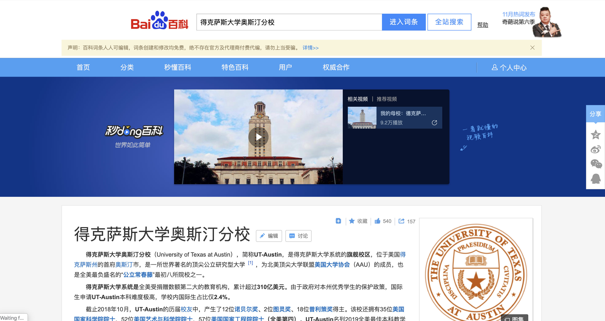

```{r setup, include=FALSE}
knitr::opts_chunk$set(echo = FALSE)
```
<style>
slide img {
  max-width: 100%;
}
h1 {
text-transform: uppercase;
}
h2 {
  text-align:center;
  letter-spacing: 2px;
}
h3 {
  text-align:center;
  margin-top:20%;
  font-size: 80px;
}
slides > slide {
  font-family: "Times New Roman", Times, serif;
  background: white;
}
slides > slide.title-slide hgroup{
  font-weight: bold;
  color:black;
  position: fixed;
  top: 50%;
  left: 50%;
  transform: translate(-50%, -50%);
}
slides > slide.title-slide hgroup p{
text-align: center;
}
</style>

## Intro To Baidu Baike

Baidu Baike  is a Chinese-language, collaborative, web-based encyclopedia owned and produced by the Chinese search engine Baidu. 

*  16,363,199 entries
* 155,766,126 edits
*   6,948,504 participants


## Project One

- Created a Baidu account
- Created, edited and submitted an entry of UT Ischool
- Failed to pass system audit 
- Started an appeal and submitted again




## Project Two
 - Collected latest information, edited and submitted the entry
 - Waited for a while and got a message
 - Corrected mistakes and submitted again



## Conclusion
* Editting process
    + Easier than I thought
* Review process
    + More complicated than I thought
* About Baidu Baike
    + Typical peer production community
    + Strict review mechanism
    
---
### Thanks For Watching!

