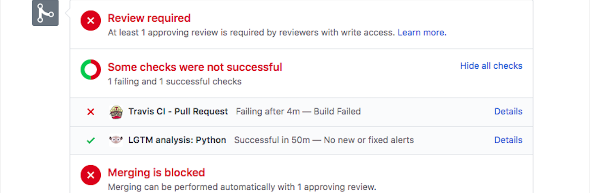
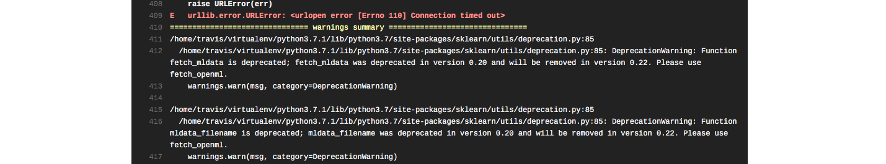

```{r setup, include=FALSE}
knitr::opts_chunk$set(echo = FALSE)
```

## Peer Production Community


- GitHub community: [TheAlgorithms/Python](https://github.com/TheAlgorithms/Python)  
  
- Coomunity purpose: To provide algorithms in Python for **Education purposes**
  
- My motivation: Fun, Enhancement


## WorkFlow Designed

   
 [workflow diagram](https://drive.google.com/file/d/1Mduc1xVpRIovQrPkTZZaC1d-stthS07O/view?usp=sharing)
 

## Pull Request Output

| Pull Request | Pass/Fail Automated Test | Error | Approved/Denied/Pending By A User |
| :--- | :----:  | :------: |  ---: |
| Request #1 | Fail | Format Error | Approved |
| Request #2  | Fail| Unused Package Error | Pending |
| Request #3| Passed 1/2 | Server Connection Error | Pending  |

## Current Status

  


## Error




## Conclusion

- Understanding how the community works is vital
- Familiarizing with rules may take some time


