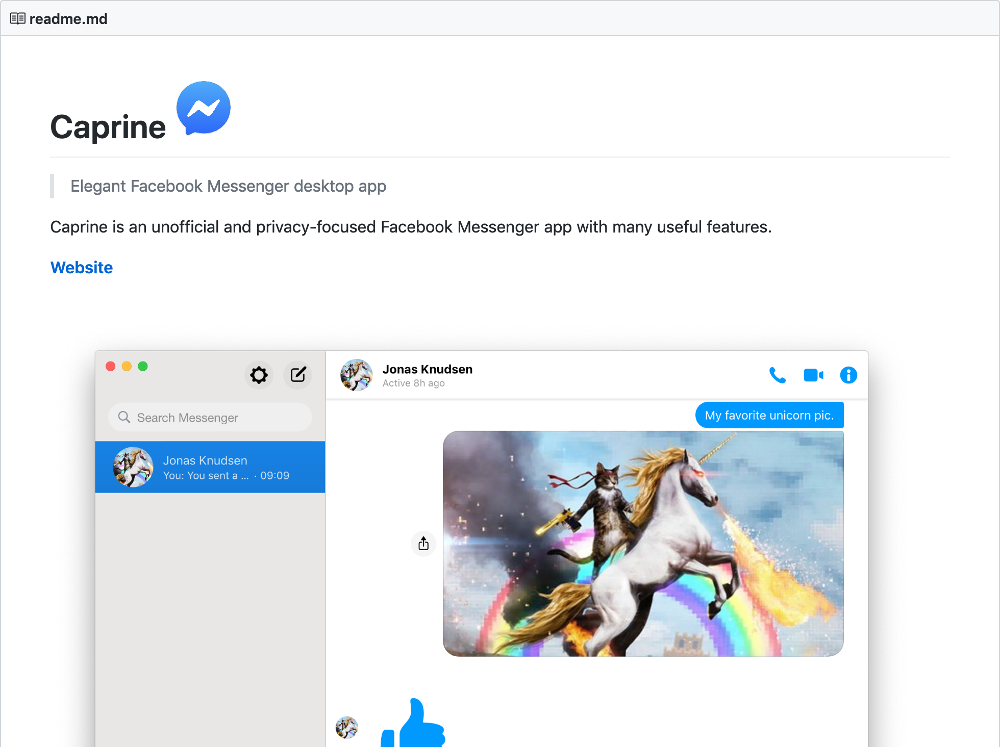
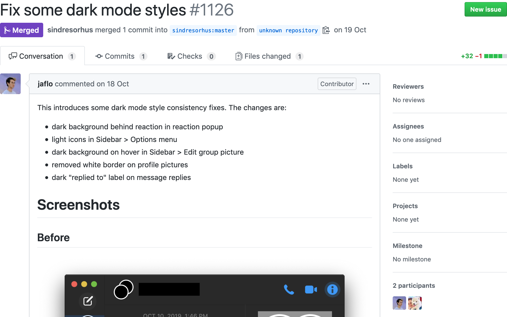
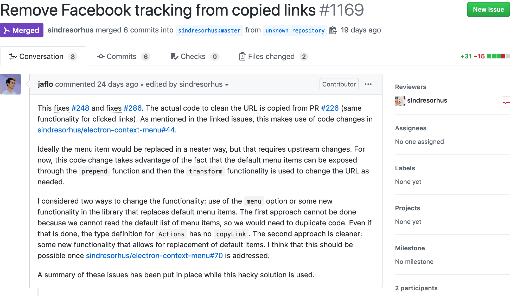
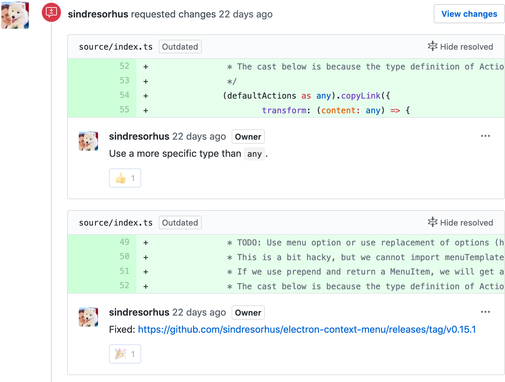
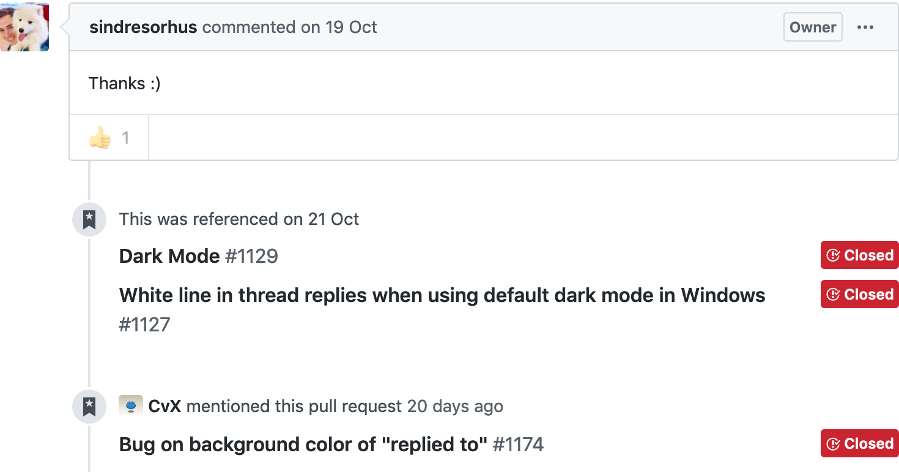
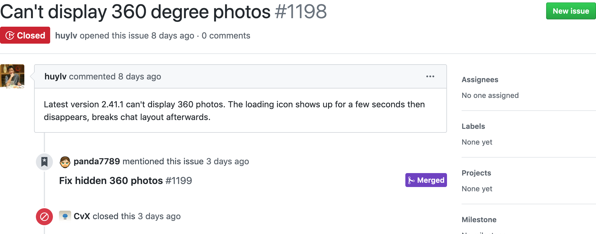
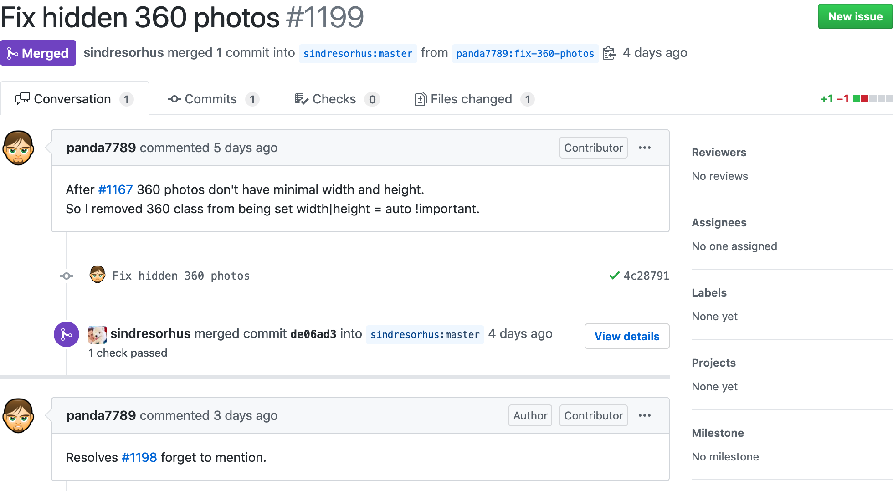

```{r setup, include=FALSE}
knitr::opts_chunk$set(echo = FALSE)
```

<style>
slide img {
  max-width: 100%;
}

slides > slide {
  background: white;
}

slides > slide:not(.nobackground):after {
  background: #eee;
  border-radius: 4px;
  border: 3px solid white;
  padding: 1px 10px;
  margin: -4px -13px;
}
</style>

## Intro to Caprine

Caprine is a desktop application that wraps around Facebook Messenger. It is primarily written in JavaScript and open-sourced on GitHub.



## First Contribution

- Created fork, made changes, made pull-request.
- Went through open issues to find interesting problems.
- First PR addressed some basic style issues.
- Automated testing, but approved by human reviewer.
- Merged in quickly (one day).



## Later PRs

- Later PRs grew more involved and got more feedback.
- Didn't get implemented earlier because of blockers.
- Linked to multiple issues (bug reports, feature requests, and dependencies).
- Longer turnaround (two weeks).



## Feedback

- Requests for changes in code.
- Changes to address code style and UI copy.



## Community

- Fixes issues from real users.
- Referenced later on, shows need.
- Interaction with other contributors.



## Breaking Features

- Tests don't cover all issues.
- Accidentally broke one feature.




## Questions?