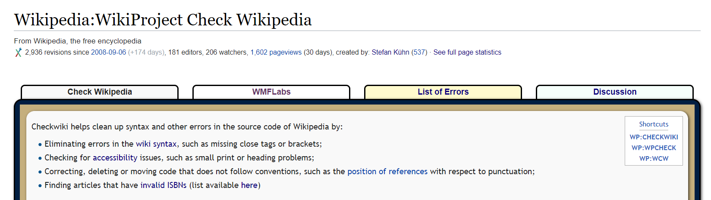
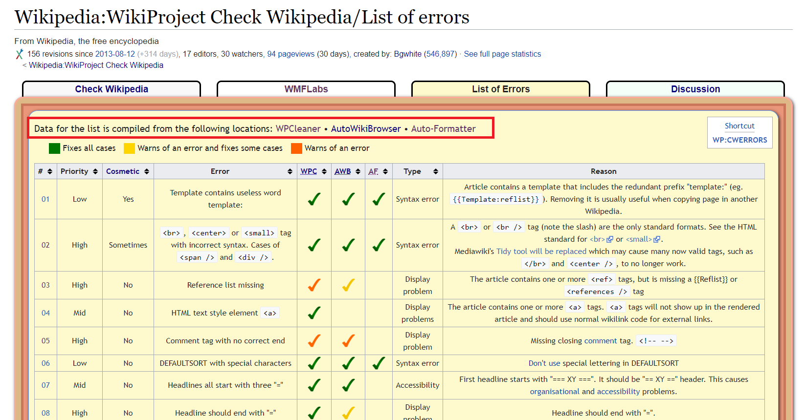
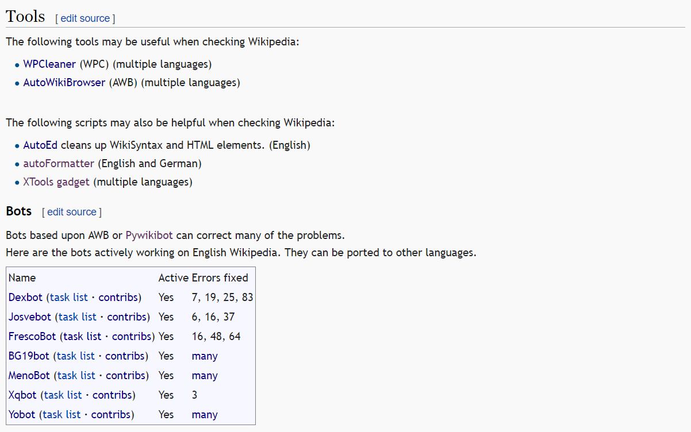
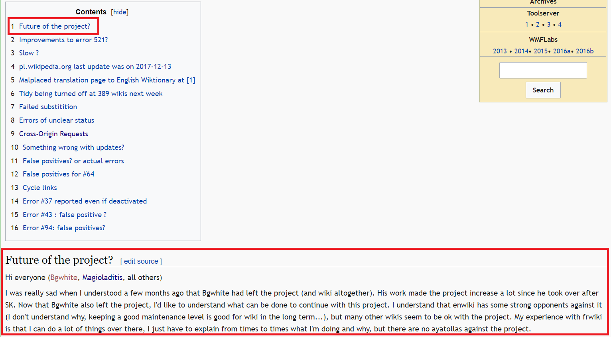
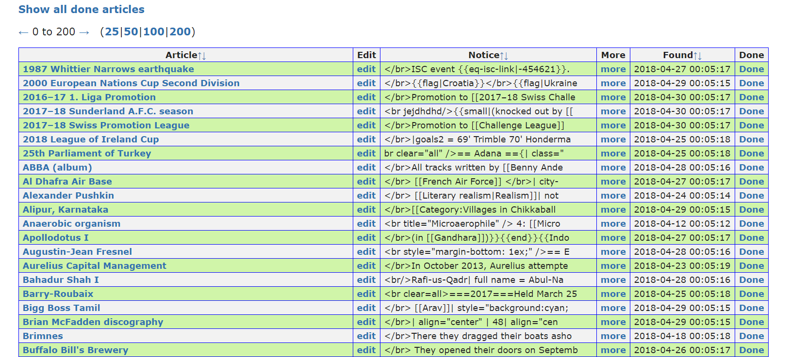
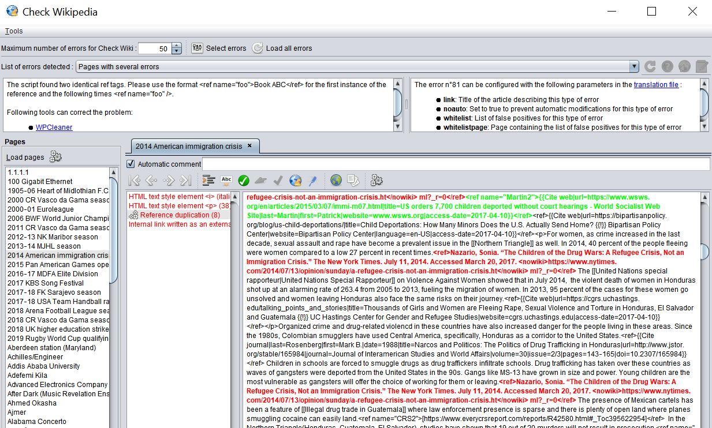
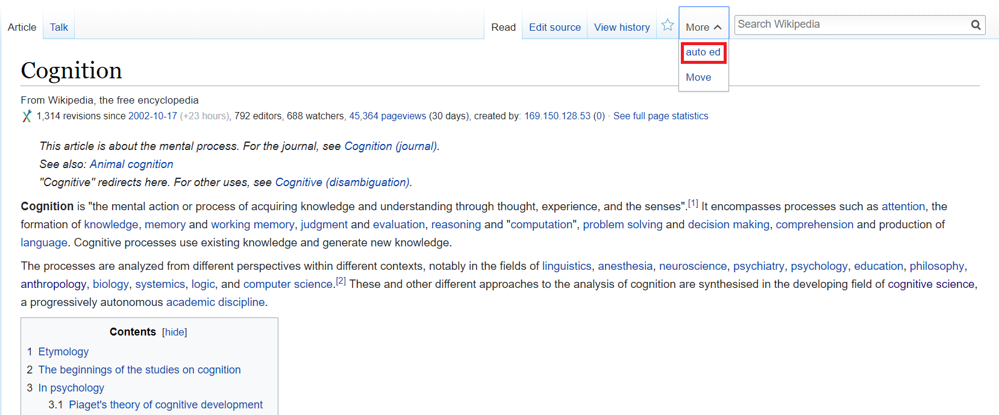
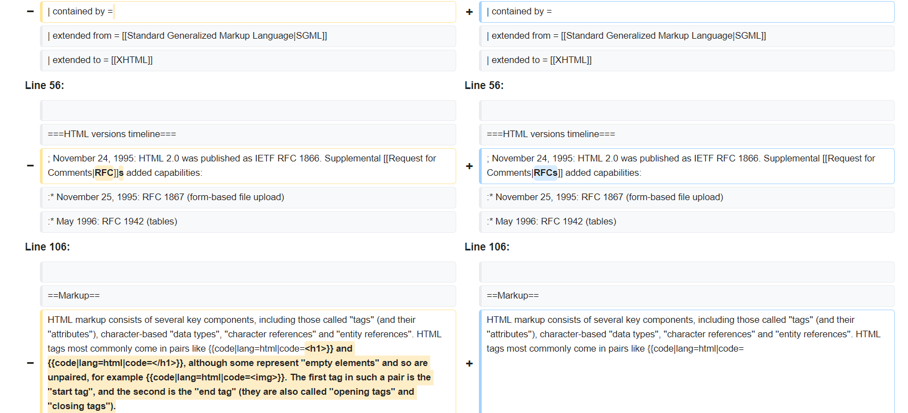
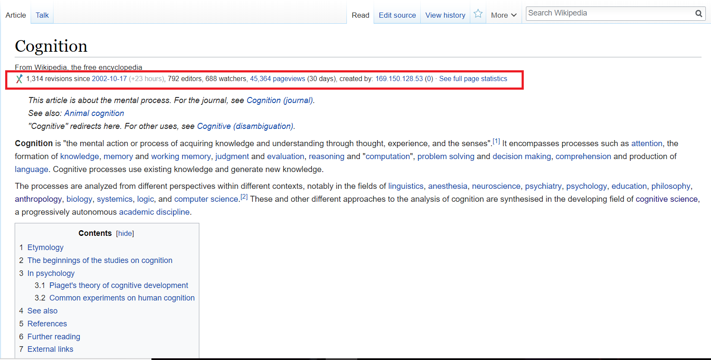

```{r setup, include=FALSE}
knitr::opts_chunk$set(echo = FALSE)
```

## WikiProject: Check Wikipedia

**Project Goal: Clean up "Lints"** 

  * Syntactic errors in source code  
  * Unconventional formatting  
  * Invalid ISBNs  
  * Web accessibility issues  
  * ...

```{r, out.width = "800px"}

```

## How do things work out?

```{r, out.width = "800px"}

```

## How do things work out?

```{r, out.width = "800px"}

```

## "Future of the Project?"

```{r, out.width = "800px"}

```

## Get My Hands (Really) Dirty

1\. Pick an error category from the error list

```{r, out.width = "800px"}

```

## Get My Hands (Really) Dirty

2\. Pick a page with detected error in a sublist

```{r, out.width = "800px"}

```

## Get My Hands (Really) Dirty

  1. ~~Pick an error category from the error list~~
  2. ~~Pick a page with detected error in a sublist~~
  3. ~~Locate the error in the article~~
  4. ~~Fix the error by editing wiki text~~
  5. Publish the change 
  6. ~~Go back to the error list and mark the page as “done”~~

**Result: Successfully finished 2 edits in more than 1 hour.** (*Hurray!*)

## Lint Rolling in the Semi-automated Way

  1. ~~AutoWikiBrowser~~
  2. ~~AutoFormatter~~
  3. WPCleaner
  4. AutoED
  5. XTools on-wiki Gadget

## Lint Rolling in the Semi-automated Way

3\. WPCleaner

```{r, out.width = "800px", out.height = "420px"}

```

## Lint Rolling in the Semi-automated Way

4\. AutoEd

```{r, out.width = "800px"}

```

## Lint Rolling in the Semi-automated Way

4\. AutoEd

```{r, out.width = "800px"}

```

## Lint Rolling in the Semi-automated Way

5\. Xtool Gadget

```{r, out.width = "800px"}

```

## Last Reflection


**Final Results**:
 
  * Selectively use AutoEd & XTool
  * Occasionally fix errors after reading articles
  * Finished more than 20 edits.

