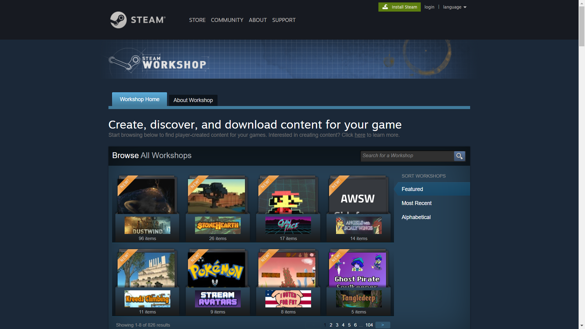
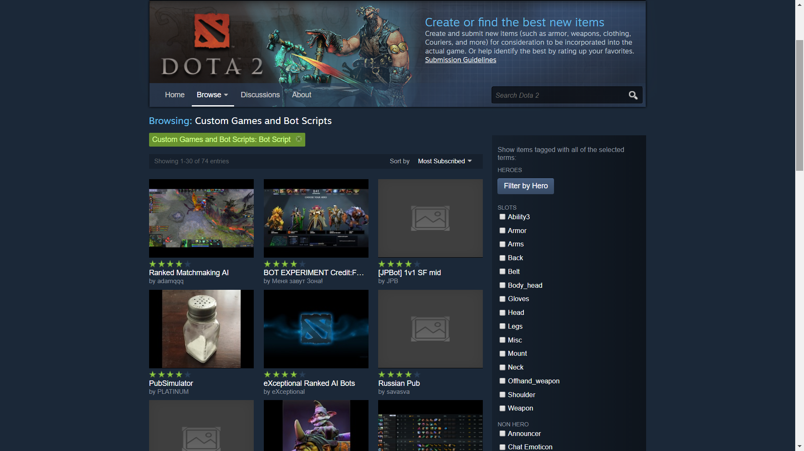
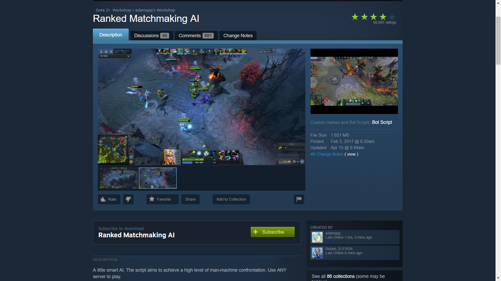
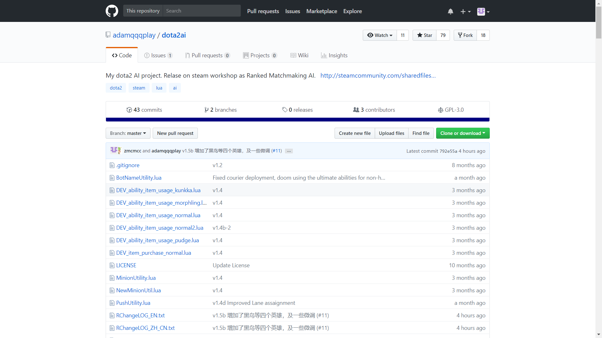
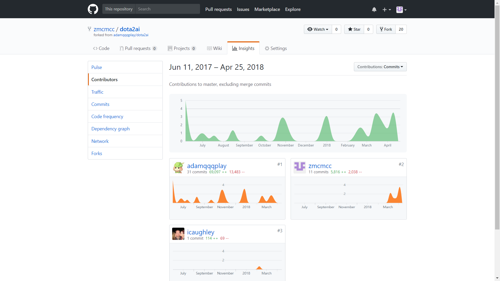
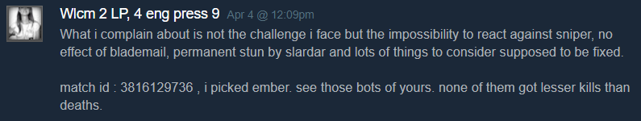
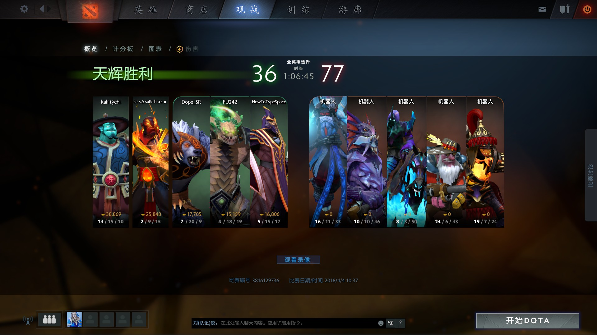

```{r setup, include=FALSE}
knitr::opts_chunk$set(echo = FALSE)
```

## Steam Workshop
Steam Workshop is affiliated  to Steam, a digital distribution platform developed by Valve Corporation. It is a central hub of player-created content and tools to publish, organize, and download that content into your games.

<center>
  
A webpage of Steam Workshop
</center>

## Dota 2 AI scripting

* Dota 2 is a multi-player Online Battle Area game. Apart from playing with human players, we can also play with bots.
* The default bot is weak so Valve opened the AI scripting on the Workshop so that we can program our custom AI script.

<center>
  
A lot of AI scripts available on Steam Workshop
</center>

## My project

My project is called Ranked Matchmaking AI. The main developer hopes this script can simulate the experience of playing with human players.

<center>
  
Our project's homepage
</center>

## My project

<center>
  
Our project's GitHub page
</center>


## My Participation
* I first forked the project and cloned it to my local host.
* Then I learned the grammar of Lua and studied the source code.
* Several days later I started to modify the code.
* I sent my first pull request on March 23rd and got approved.  
  
The changeLog of my first update

## My Participation
Part of my codes:  
```lua
----------------------------------------------------------------------------
--	Ranked Matchmaking AI v1.5b 
--	Author: adamqqq		Email:adamqqq@163.com
--  Contributor: zmcmcc Email:mengzhang@utexas.edu
----------------------------------------------------------------------------
--------------------------------------
-- General Initialization
--------------------------------------
local utility = require( GetScriptDirectory().."/utility" ) 
require(GetScriptDirectory() ..  "/ability_item_usage_generic")

local debugmode=false
local npcBot = GetBot()
local Talents ={}
local Abilities ={}
local AbilitiesReal ={}

ability_item_usage_generic.InitAbility(Abilities,AbilitiesReal,Talents) 

local AbilityToLevelUp=
{
	Abilities[3],
	Abilities[1],
	Abilities[1],
	Abilities[3],
	Abilities[3],
	Abilities[4],
	Abilities[3],
	Abilities[2],
	Abilities[2],
	"talent",
	Abilities[2],
	Abilities[4],
	Abilities[2],
	Abilities[1],
	"talent",
	Abilities[1],
	"nil",
	Abilities[4],
	"nil",
	"talent",
	"nil",
	"nil",
	"nil",
	"nil",
	"talent",
}
local TalentTree={
	function()
		return Talents[1]
	end,
	function()
		return Talents[3]
	end,
	function()
		return Talents[5]
	end,
	function()
		return Talents[8]
	end
}

-- check skill build vs current level
utility.CheckAbilityBuild(AbilityToLevelUp)

function AbilityLevelUpThink()
	ability_item_usage_generic.AbilityLevelUpThink2(AbilityToLevelUp,TalentTree)
end

--------------------------------------
-- Ability Usage Thinking
--------------------------------------
local cast={} cast.Desire={} cast.Target={} cast.Type={}
local Consider ={}
local CanCast={utility.NCanCast,utility.NCanCast,utility.NCanCast,utility.UCanCast}
local enemyDisabled=utility.enemyDisabled

```

## My Achievement (Until 4.21)
* Contributed 8 commits with changes of 8000+ lines. 
* Help made updates of the script from v1.4e to 1.5c.
* Subscribers of our script increased by 100000 in a month.
* Created a testing script to test beta versions and attracted 7000+ subscribers.
* Comments from Russia, Luxemburg, Malaysia, America, China and Peru.  
<center>
  
My contribution on Github
</center>


## My Achievement (Until 4.21)
Some guys even complain that the bots are too strong...  
<center>
  
</center>
<center>
  
My bots got twice kills as real human team did...
</center>

