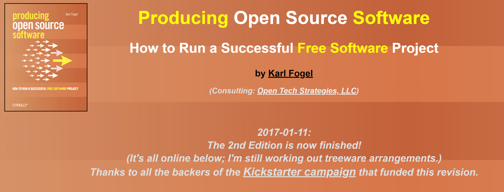
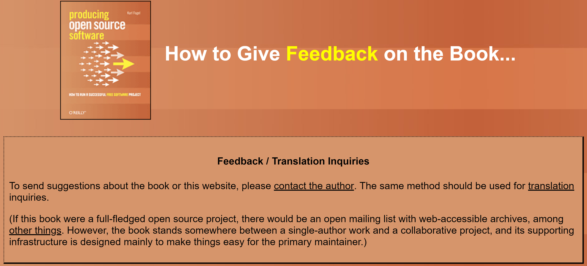
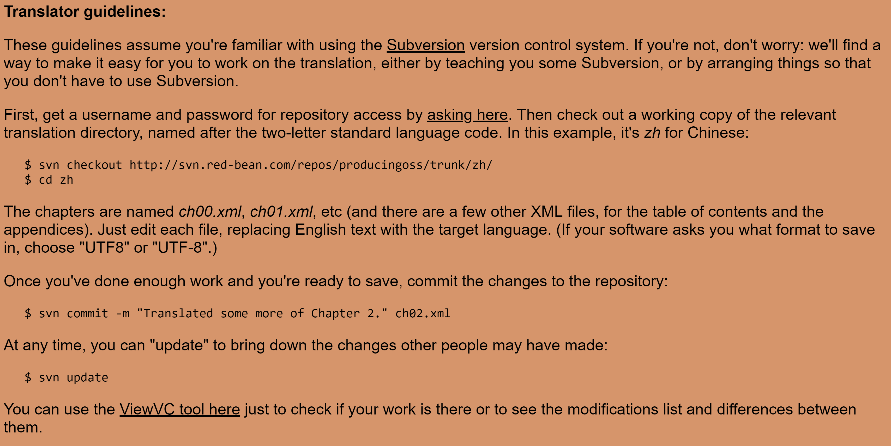
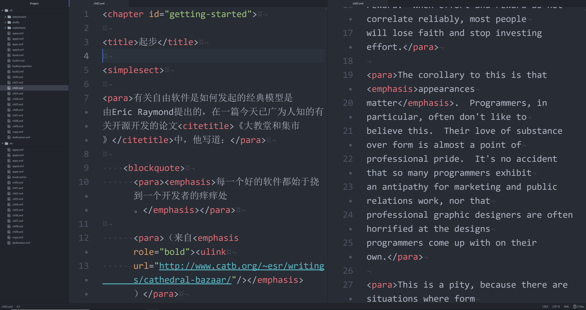
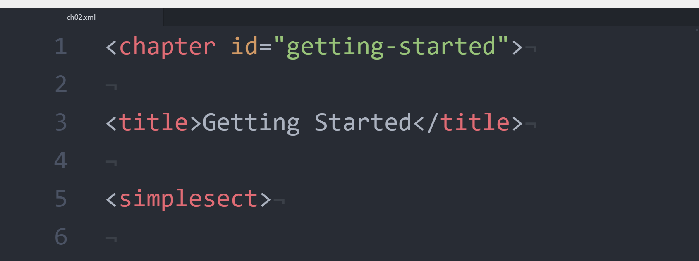
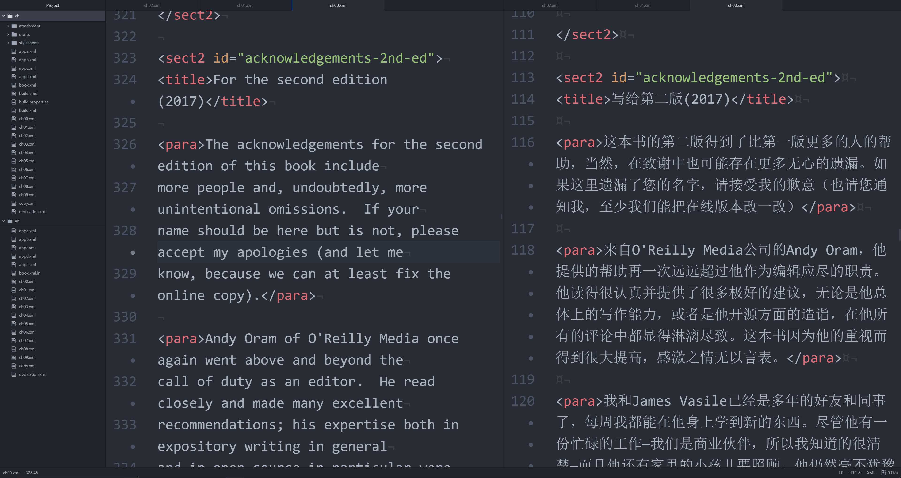
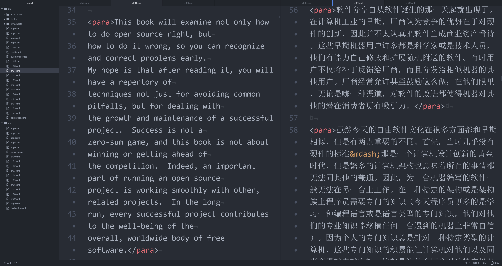
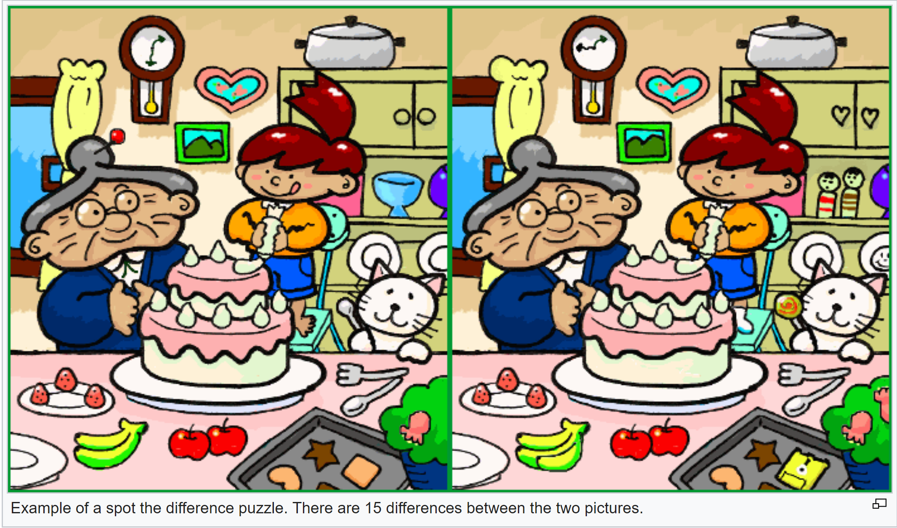
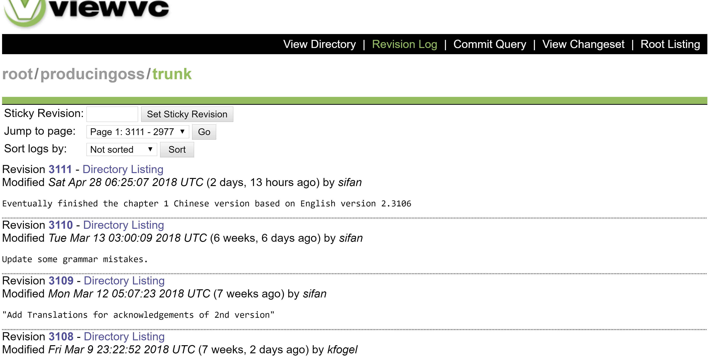

```{r setup, include=FALSE}
knitr::opts_chunk$set(echo = FALSE)
```

## An Eye-Opening Book
The book _Producing Open Source Software_ is really fascinating, author _Karl Fogel_ uses many analogies in this book, which is my favorite writing style, hence translating it along with reading it is enjoyable for me.

```{r, out.width = "760px"}

```
(The the screenshot of <https://producingoss.com/>)

## Before Contribution

- Apply For An Account


## Before Contribution

```{r, out.width = "760px"}

```
(The screenshot of <https://producingoss.com/feedback.html>)

## Before Contribution

- Apply For An Account
- Learn Subversion(SVN)

## Before Contribution

```{r, out.width = "760px"}

```
(The screenshot of <https://producingoss.com/translations.html#guidelines>)


## Before Contribution

- Apply For An Account
- Learn Subversion(SVN)
- Get Familiar with XML

## Before Contribution

```{r, out.width = "760px"}

```

## Start the Journey


## Start the Journey

```{r, out.width = "760px"}

```

## My Favorite Part


## My Favorite Part

```{r, out.width = "760px"}

```

## Standing On the Shoulders of Giants


## Standing On the Shoulders of Giants

```{r, out.width = "760px"}

```

## Standing On the Shoulders of Giants

```{r, out.width = "760px"}

```

### &nbsp;&nbsp;&nbsp;&nbsp;&nbsp;&nbsp;&nbsp;&nbsp;&nbsp;&nbsp;&nbsp;&nbsp;&nbsp;&nbsp;&nbsp;&nbsp;&nbsp;&nbsp;&nbsp;&nbsp;&nbsp;&nbsp;&nbsp;&nbsp;&nbsp;&nbsp; What does this look like?

## Spot the Difference

```{r, out.width = "760px"}

```
(Source: Japan Wikipedia)

## Why Am I "Lazy"?


## Why Am I "Lazy"?

```{r, out.width = "760px"}

```
(The screenshot of <br><http://viewvc.red-bean.com/producingoss/trunk/?view=log>)

## Why Am I "Lazy"?

- No Instant Feedback


## Why Am I "Lazy"?

- No Instant Feedback
- No Deadline

## &nbsp;
### &nbsp;
### &nbsp;
### &nbsp;
### &nbsp;
### &nbsp;&nbsp;&nbsp;&nbsp;&nbsp;&nbsp;&nbsp;&nbsp;&nbsp;&nbsp;&nbsp;Thank You for Watching!


