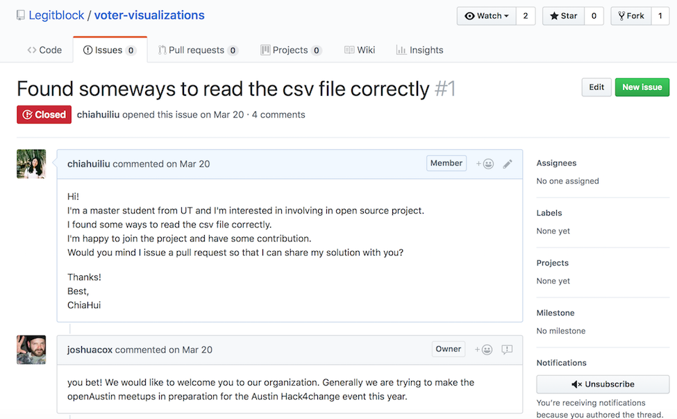
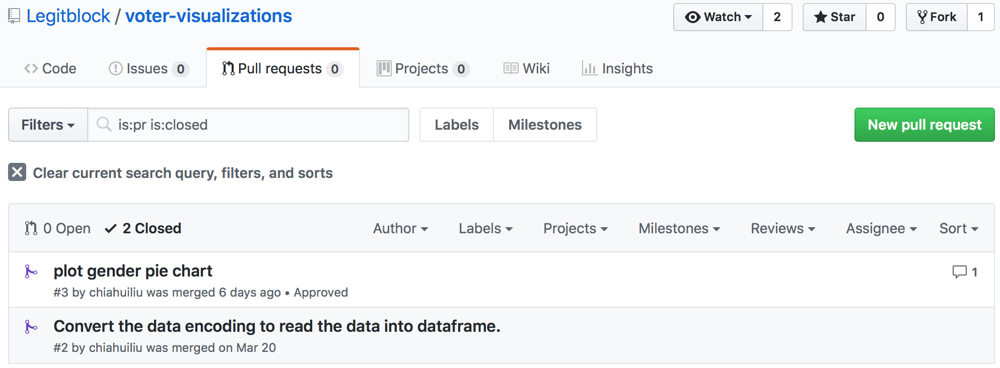

```{r setup, include=FALSE}
knitr::opts_chunk$set(echo = FALSE)
```

## Introduction

Open Austin

- Voter visualizations
  
    open data of registered voters released by the Austin government
  
- Name a stray

    an online platform to help name stray animals

## Experience
1. Voter visualizations
    
    - Communication: issues, pull requests on GitHub, emails
    ```{r, out.width = "500px"}
      
    ```
2. Name a stray
  
    - Slience

## Contributions

1. Solve the encoding issues
2. Plot pie chart of registered voters on gender

    ```{r, out.width = "800px"}
      
    ```

## Reflections

1) Other participants' proactivities are critical

2) Open Austin is a peer production community
    
    Decentralized tasks, sparation of governance and the ownership, and the social motivations of participants
