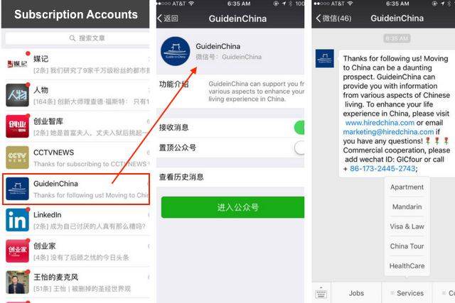
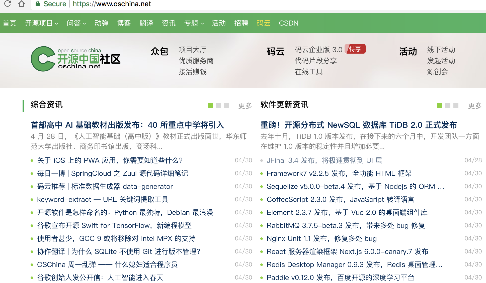
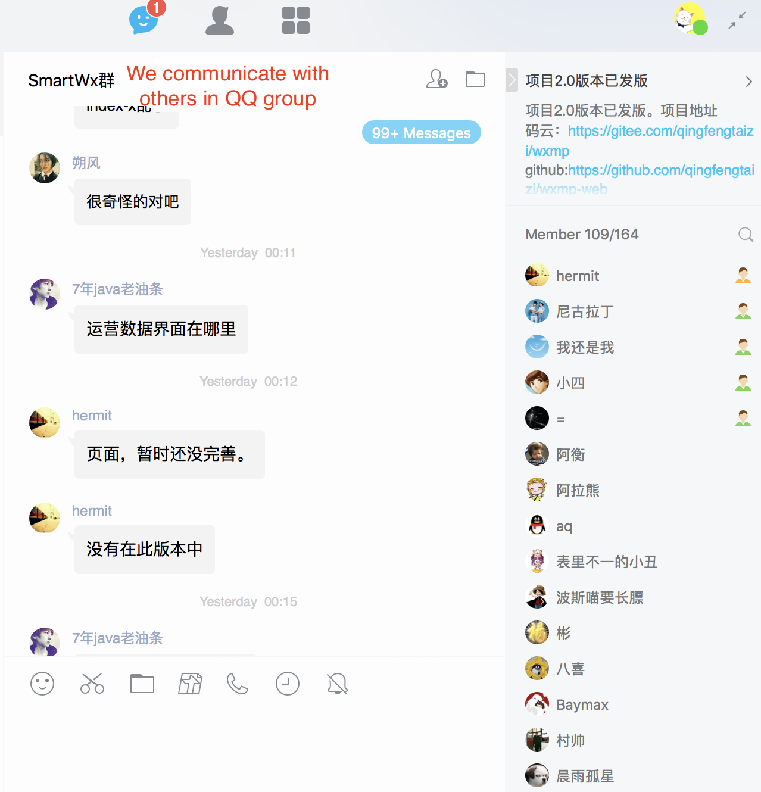
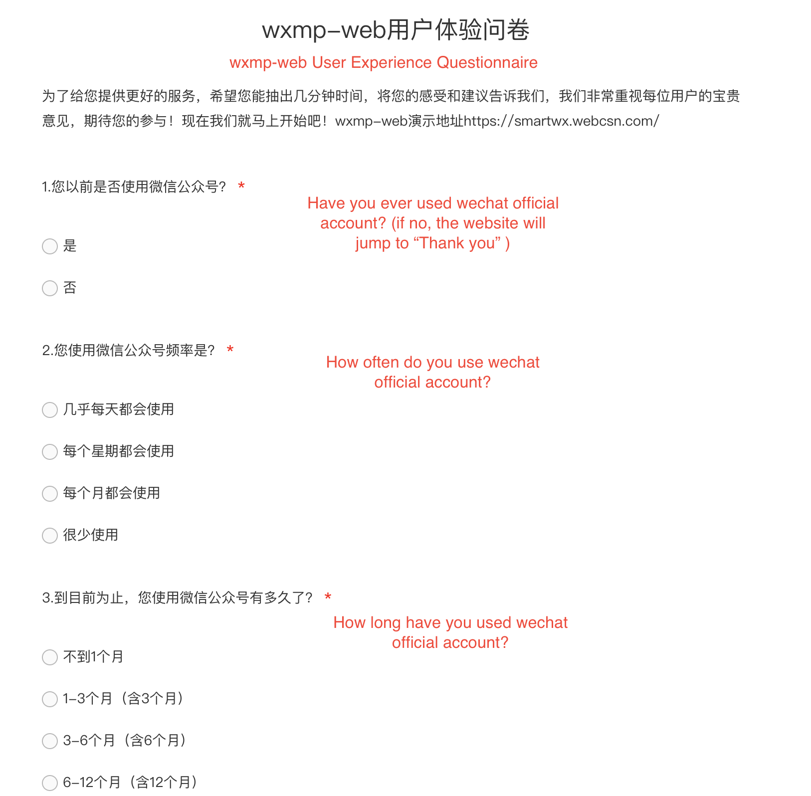
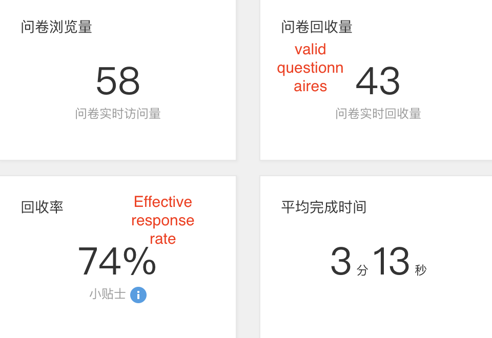
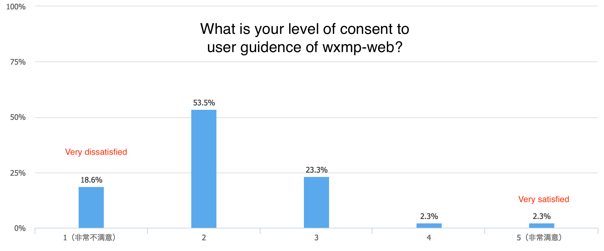
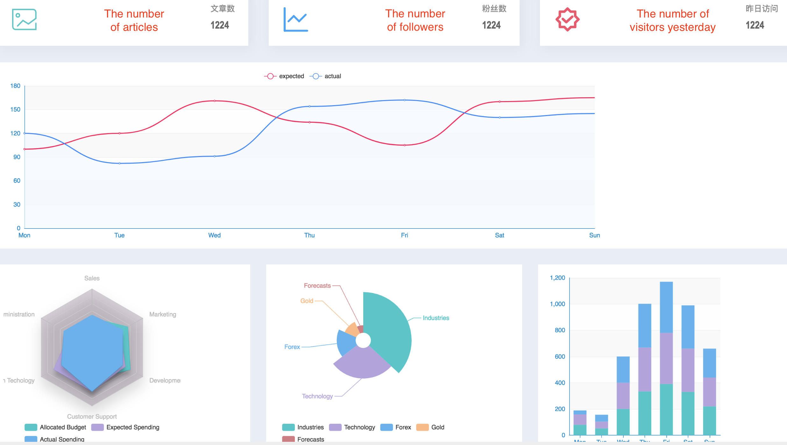

```{r setup, include=FALSE}
knitr::opts_chunk$set(echo = FALSE)
```
## About wxmp-web(SmartWx)

- WeChat: a Chinese multi-purpose messaging and social media app

- Official account: a great self-media platform 

- Wxmp-web: official account web management tool 

```{r, out.width = "800px",out.height ="400px"}

```

## Find the project on opensourcechina

```{r, out.width = "800px"}

```

## My participation

- User research

- Translation and English version website 

```{r, out.width = "600px",out.height ="400px"}

```

---

### User research

- User questionnaire  

```{r, out.width = "50%px",out.height ="50%px"}


```

---

- User experience analysis

```{r, out.width = "800px",out.height ="500px"}

```

---

### Translation and English version website 

- Translates the related Chinses proper nouns to English

- Prepare for the English version website

```{r, out.width = "800px",out.height ="400px"}

```

## Experience

- Programming threshold and hope to contribute as a programmer

- Participate in other ways according to team's needs

- Passion: participate as a member of the team


## Reflection

- A few of people take most of the tasks

- Participant's motivation may change


