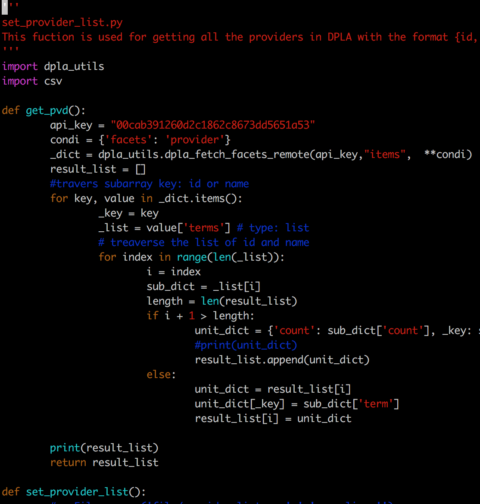
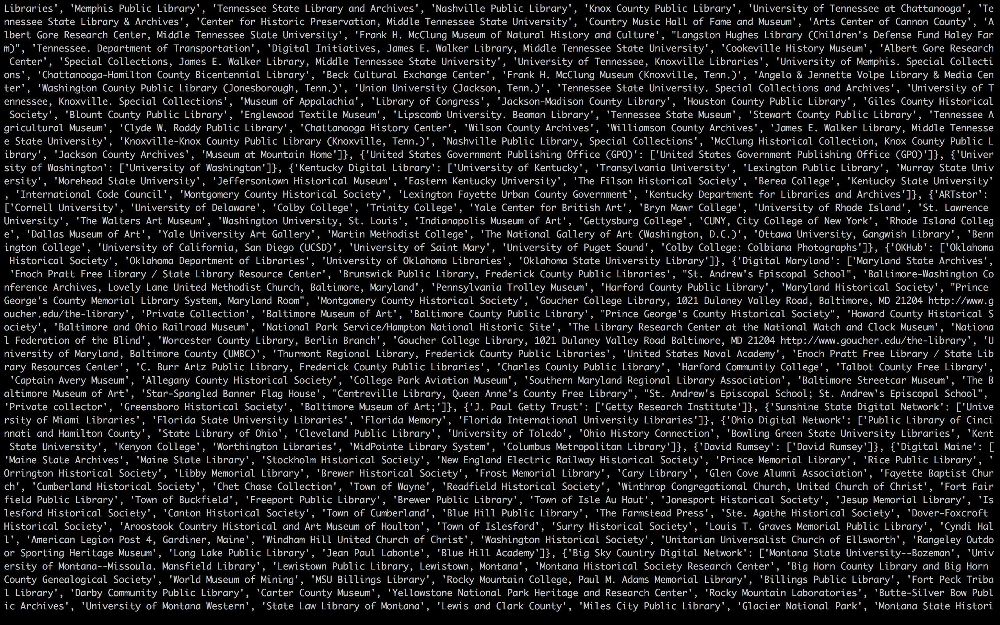

## Introduction

- DPLA

Digital Public Library of America is is public domain and openly licensed content held by the United States' archives, libraries, museums, and other cultural heritage institutions. It has a large and complete Hub network to collect data.

- APIs

DPLA’s API provides programmatic search and access to every item in the DPLA catalog. Use the API to power an app, to wire DPLA into your portal, or to retrieve data to build something entirely your own. DPLA also providers complete API tutorial to get you started

## The Workflow of How DPLA Collects Items

## What did I do

The function I planed to implement is getting the list of provider and dataProvider. I went through the API document and Metadata Application Profile, and figure out what information each item contains as metadata. And then I tried to find which interface I should use, and studied what workflow and algorithm should be in my code, and how providers relate to dataProviders. Finally when I implemented the function and debugged, I put all the sample in one package and run them together, to see whether there is a conflict or not.

## The result

Here are the results:

- Provider list

- dataProvider list

## Thank you

Thanks for Watching!

