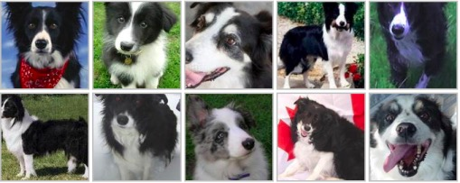
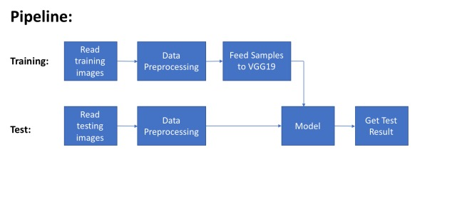
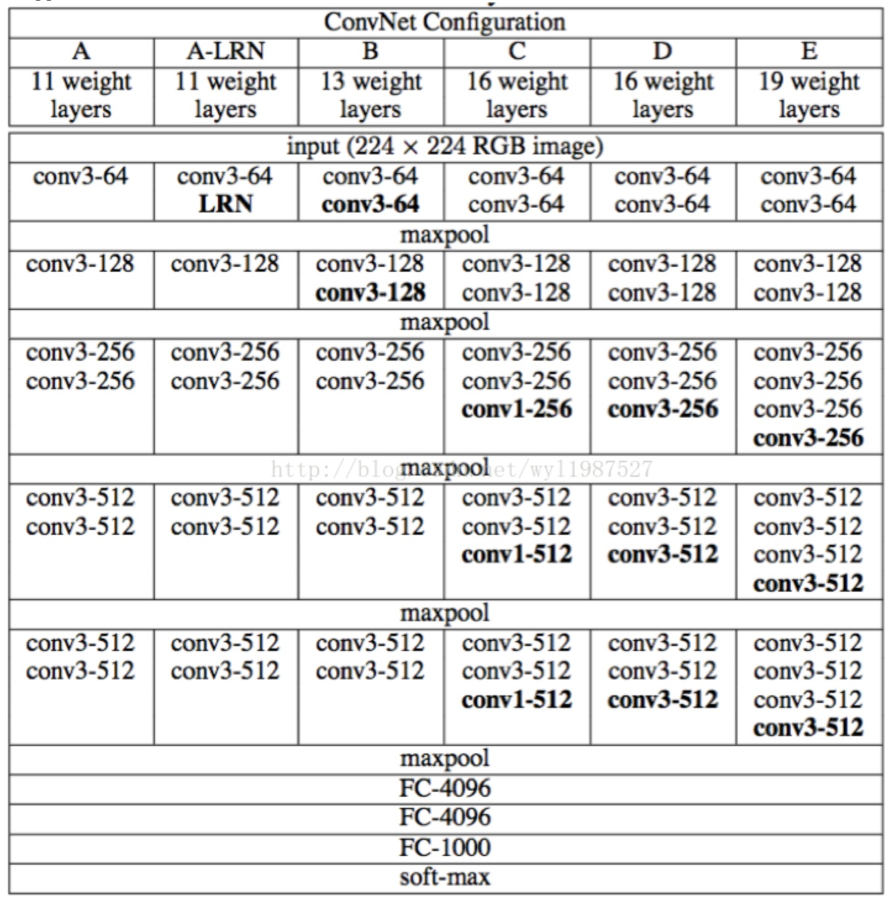
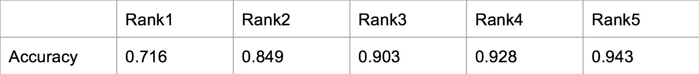
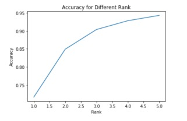
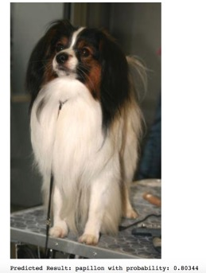

```{r setup, include=FALSE}
knitr::opts_chunk$set(echo = FALSE)
```
## Project Introduction
- A fun project to classify dog breeds using deep learning.(https://github.com/yizhenwang0811/dog_breed_identification) 
- Inspired by Kaggle Playground Prediction Competition: Dog Breed Identification (https://www.kaggle.com/c/dog-breed-identification)
-  Stanford Dogs Dataset
<br> </br>

</img>


#### Relevant technology
- Vgg19
- TensorFlow

## what I have done?
#### Dataset Information
<b> Contents of Stanford Dogs dataset:</b><br> </br>
- Number of categories: 120 <br> </br>
- Number of images: 20,580 <br> </br>
- Annotations: Class labels, Bounding boxes <br> </br>

- <b>Training set</b>: Contains 12,000 images, 120 categories, 100 images for each category.
- <b>Test Set</b>: Contains 8,580 images, 120 categories.
- <b>Baseline Result</b>: around 22% by using all training dataset.

#### Deep Learning

</img>

## VGG19
 <br></br>
- test ac: 0.669 loss:1.189 <br></br> 
- test ac: 0.647027 loss: 1.175797 <br></br> 
- test ac: 0.704753 loss: 0.994599 <br></br> 
- test ac: 0.716471 loss: 0.946612 <br></br> 

<br></br> 
Experiment Setting
<br></br> 
- 1.batch size = 64
<br></br> 
- 2.Initial learning rate 0.001,decay step = 100, decay rate = 0.9
<br></br> 
- 3.Activation function: ReLu
<br></br> 
- 4.Dropout: 0.5

## Result of Only Training the Last Fully Connected Layer:
</img>

</img>

### Visualization
</img></img>

## Conclusion
### Deep learning is far much better on accuracy:
- Need larger dataset 
- Extract better features

### Traditional Methods also have advantages:
- Run Faster
- More explainable
- If we have small dataset, less computation resource, or easier tasks
